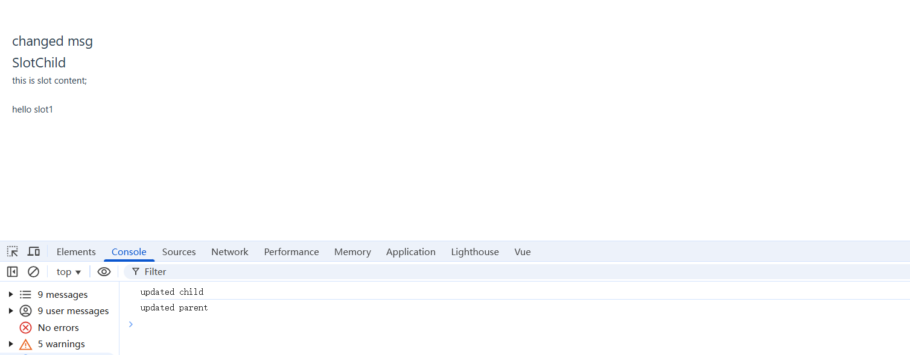

## vue使用slot时子组件的onUpdated执行问题

在使用 Vue 的插槽 (slot) 功能时，可能会遇到一个问题：当父组件的任何状态更新时，子组件的 `onUpdated` 事件会被触发。这个问题在使用默认插槽时尤为明显。为了避免这种情况，可以使用**作用域插槽**。

### 示例代码

以下是一个示例，展示了如何使用默认插槽和作用域插槽。

#### 父组件 (`slot.vue`)

```vue
<template>
    <div class="about">
        <h1>{{ msg }}</h1>
        <SlotChild class="parentClass">
        this is slot content; 
    <!-- 注释下一行就不会触发onupdated -->
        <slot></slot>
        <!-- 作用域插槽 可以访问子组件的状态 -->
        <template #s2="scope">
            hello slot1 
            {{ scope.text }}
        </template>
        </SlotChild>
    </div>
</template>

<script setup>
import SlotChild from './SlotChild.vue'
import { ref, onUpdated } from 'vue'

const msg = ref('this is messages')

onUpdated(() => {
    console.log('updated parent')
})

setTimeout(() => {
    msg.value = 'changed msg'
}, 1000)
</script>
```

#### 子组件 (`SlotChild.vue`)

```vue
<template>
    <div class="about">
        <h1>SlotChild</h1>
        <slot name="default">
            this is default content
        </slot>
        <!-- 具名插槽,在一个组件里有多个插槽出口 -->
        <p>
            <slot name="s1" :text='text1'></slot><br>
            <slot name="s2" :text='text2'></slot><br>
        </p>
    </div>
</template>

<script setup>
import { ref, onUpdated } from 'vue'

const text = ref('this is default text')
const text1 = ref('this is scoped text1')

onUpdated(() => {
    console.log('updated child')
})
</script>
```


### 解释

在上面的示例中，父组件 `slot.vue` 使用了默认插槽和作用域插槽。默认插槽会导致子组件在父组件状态更新时触发 `onUpdated` 事件。而作用域插槽则不会有这个问题，因为它们只会在相关的插槽内容发生变化时才会更新。

根据 Vue 官方文档的解释，作用域插槽允许我们将数据从子组件传递到父组件，从而避免不必要的更新。

通过使用作用域插槽，可以更好地控制组件的更新行为，避免不必要的性能开销。

### 参考资料

- [Vue.js 官方文档 - 插槽](https://v3.vuejs.org/guide/component-slots.html)
- [Vue.js 官方文档 - 作用域插槽](https://v3.vuejs.org/guide/component-slots.html#scoped-slots)

